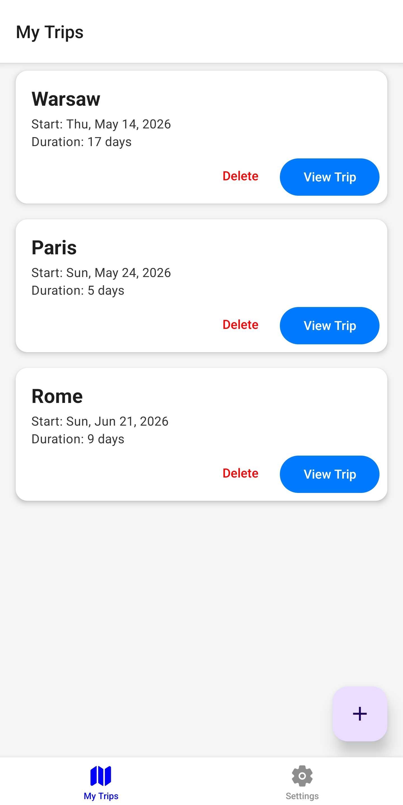
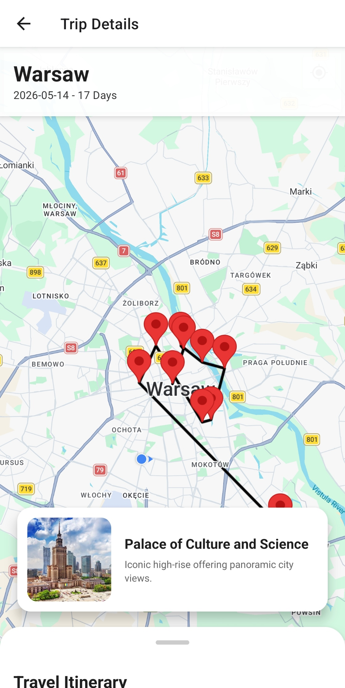
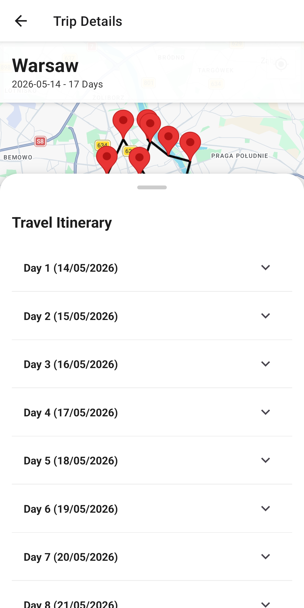

# RoamLite - Smart Travel Itinerary Manager

RoamLite is a high-performance, offline-first travel itinerary manager built natively with React Native and Expo. It allows users to dynamically generate smart, day-by-day travel routes for major cities. With an algorithmic nearest-neighbor routing engine, interactive checklists, and a sleek map interface, RoamLite takes the stress out of travel planning.

## App Screenshots

- **My Trips Dashboard**:
  

- **Interactive Calendar & Route Generation**:
  

- **Smart Map & Floating Location Cards**:
  

- **Travel Itinerary**:
  

## Setup & Execution Instructions

### Local Development (Expo Go)
1. **Install Dependencies**
   ```bash
   npm install
   ```
2. **Run the App**
   ```bash
   npx expo start
   ```
   *Scan the QR code with your phone (Expo Go app) or press `a` / `i` to launch on a local emulator.*

3. **Run Unit Tests**
   ```bash
   npm run test
   ```

### Production Build (EAS)
To generate a standalone `.apk` for Android:
1. Configure EAS (if not already done): `npx eas-cli init` or `eas build:configure`
2. Run the build command: 
   ```bash
   eas build --platform android --profile preview
   ```

## Architecture & Project Structure

The project utilizes a strict **Component/Screen Pattern** combined with **Zustand** for decoupled, hook-based global state management, avoiding the boilerplate of Redux Toolkit and the prop-drilling performance issues of React Context.

```text
src/
├── components/   # Reusable, stateless UI components (TripCard, LoadingSpinner)
├── screens/      # Complex views (MyTrips, TripDetails, AddTripModal, Settings)
├── store/        # Zustand global state (tripStore.ts)
├── utils/        # Core business logic (smart routing algorithm, secureStore, types)
app/              # Expo Router configuration (Tabs, Stacks, Modals)
```

## Feature Highlights (Grading Rubric Alignment)

- **Smart Routing Algorithm**: The itinerary generator utilizes a nearest-neighbor mathematical algorithm (calculating coordinate distance) to chart a logical, geographically efficient path through cities, ensuring the map polyline reflects a realistic walking/driving tour.
- **Native Device Features**: 
  - `expo-location`: Requests permissions and displays real-time user location on the map.
  - `expo-haptics`: Provides subtle, tactile vibration feedback during form submissions.
  - `expo-secure-store`: Natively encrypts and securely stores sensitive API tokens in the device's Keychain/Keystore.
- **Offline First & Global State**: **Zustand** manages global app state, paired directly with `AsyncStorage` via the `persist` middleware. Users can plan trips, close the app, and browse their itineraries completely offline in airplane mode.
- **Advanced Navigation**: Implements **Expo Router** with a complex hybrid system: Bottom Tabs (`/(tabs)`), Stack Navigation with dynamic parameters (`/trip/[id]`), and a Modal overlay (`AddTripModal`).
- **Asynchronous Data Handling**: Uses `async/await` with `Promise`-based artificial delays to simulate API network requests, actively managing UI `loading` spinners, `error` fallbacks, and success states.
- **High-Performance UI**:
  - Uses `FlatList` and dynamic `AccordionGroup` mapping for rendering optimized lists.
  - Implements a custom 60fps draggable bottom sheet using the `Animated` API and `PanResponder` to bypass the React bridge.
  - Strict Material Design aesthetics using **React Native Paper**.
- **Robust Error Handling & Security**: Graceful error UI handling, strict TypeScript interface validation, safe map-rendering fallbacks, and encrypted device storage for keys.
